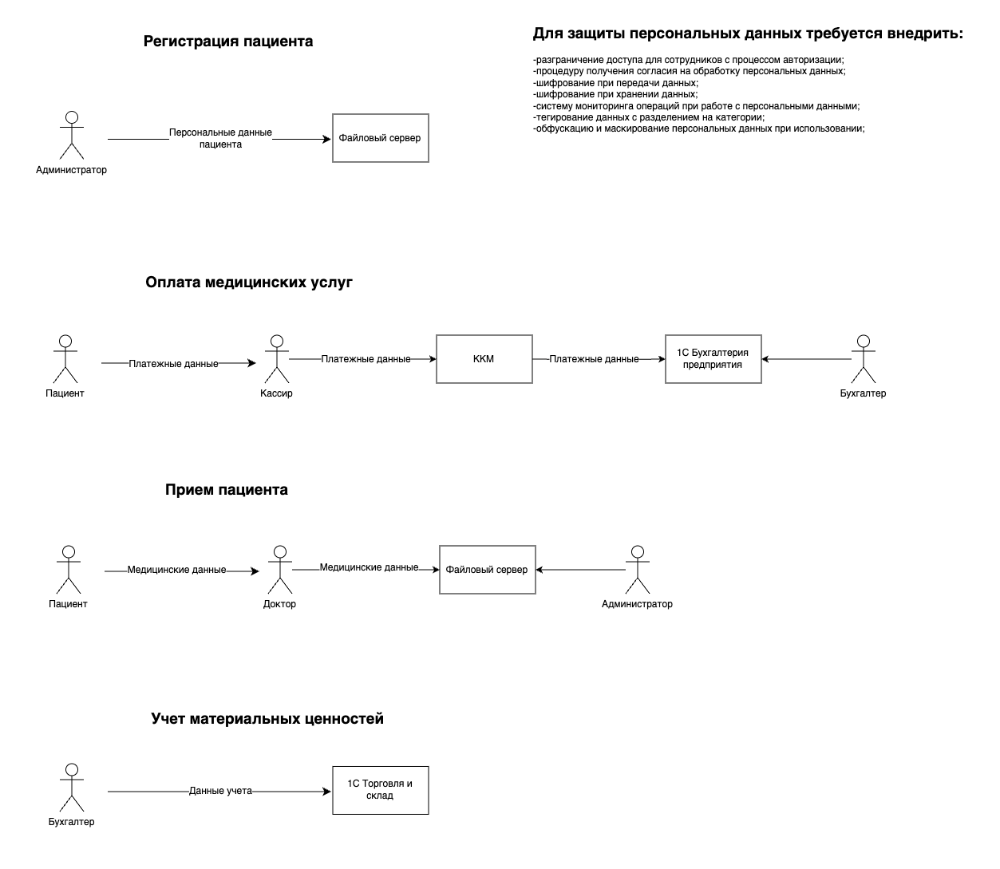

# Анализ состояния конфиденциальности

Платформа Medikamente хранит огромное количество незащищенной персональной медицинской информации, при этом:      
-управление персональными данными отсутствует;       
-отсутствует аутентификации пользователей;       
-не реализован принцип минимальных привилегий;  

-отсутствует политика классификации данных;     
-персональные данные хранятся в незащищенном виде;  
-персональные данные передаются в незащищенном виде, отсутсвует шифрование;  
-персональные данные обрабатываются в незащищенном виде;  
-отсутствует резервное копирование; 
-отсутствует процедура получения согласия на обработку персональных данных;     

-отсутствует защита инфраструктуры информационной системы;  
-отсутствует система мониторинга событий безопасности, включая попытки несанкционированного доступа;  
-отсутствует план реагирования на инциденты, включая восстановление системы;        

Потоки данных в компании:       
