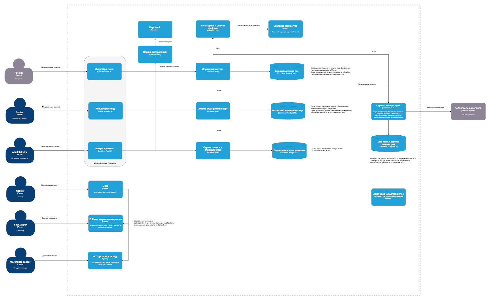

# Data Privacy  

Для защиты персональных данных требуется внедрить:  
-разграничение доступа для сотрудников на основе ролевой модели с процессом авторизации;    
-процедуру получения согласия на обработку персональных данных от пациентов;    
-использовать принцип data minimisation, не собирать лишние персональные данные;    
-шифрование при передачи данных;        
-шифрование при хранении данных;        
-сроки хранения данных;         
-систему мониторинга операций при работе с персональными данными и оповещением об инцидентах;       
-тегирование данных с разделением на категории;     
-маскирование персональных данных при использовании и хранении;   

Для управления данными можно использовать платформу BigID-Deep Data Intelligence, она позволяет сканировать хранилища данных и классифицировать по их тегам.        

